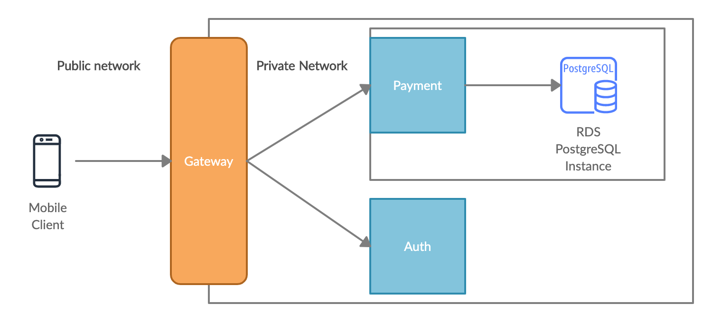

####Table of Contents

- [Introduction](#introduction)
- [Ensuring Strong Payment Consistency](#ensuring-strong-payment-consistency)
- [Installation steps](#installation-steps)
- [API documentation](#api-documentation)
  * [Authentication](#authentication)
  * [**Sending Money to another user**](#--sending-money-to-another-user--)
  * [**Retrieving a user's transaction historyr**](#--retrieving-a-user-s-transaction-historyr--)
- [How to test](#how-to-test)
  * [Feature Proposal : Ability to pay and convert to another currency](#feature-proposal---ability-to-pay-and-convert-to-another-currency)
  * [Future possible improvements](#future-possible-improvements)

#### Introduction

As a payment system we need the ability to :
- quickly scale in case there is a sudden surge in requests
- be highly available in the event of failures

For these reasons a microservices approach was deemed an appropriate architecture style.

In this solution there are 3 services :



- A **gateway** where endpoints can be published through a configuration file. The gateway is the public interface of the application. Other services are part of a private network. Each request is authenticated before being proxied to the relevant service.

- An **auth** service which validate request using a simple matching pattern for the purpose of this application

- A **payment** service which keeps track of users balances and processes transaction in a strongly consistent way. The payment service has its own postgres database.

Assumptions :

- Users can only have one account balance

 #### Ensuring Strong Payment Consistency
 
 One crucial aspect of a distributed payment system is data consistency. We should prevent users from accidentally sending the same request twice for instance.  Application clients can help us to avoid such a scenario by providing a unique request ID however bugs still can happen at other network layers, that's why we should pay close attention to consistency in our system.
 
 There are different ways to provide consistency :
  - distributed lock through a redis or zookeeper cluster
  - Two Phase Commits
  - Event based patterns like Sagas
  
 The solution I have picked is Postgres database Advisory Locks :
 
 Pros :
 
   - Simple enough to illustrate correct behaviour without too much overhead (as opposed to a distributed lock for instance)
   - Reduced contention as no rows or table are locked
    
 Cons :
   - In the event we want to switch database vendor we will need to reimplement the logic
   - There is no notion of timed locks. If a service dies with the lock we will need to do extra work to recover the lock
    

This is complementary to client-generated unique token to avoid the same request being processed twice.

The pseudocode for the implemented algorithm is as follows :
```
User A wants to send X amount to user B

L := ToString(Sort(A,B))

-- Acquire Lock L

Check user A balance > amount

Get user B balance

---- Begin transaction

   -  Create record in transactions table : A sends X to B in currency Y

   -  Update user A balance

   -  Update user B balance

    Rollback if error in any of the 3 above queries

---- End transaction

-- Release Lock L


```

The implementation of the above logic has been tested and shows to be consistent with 50 concurrent goroutines.


#### Installation steps

Dependencies :

- docker
- docker-compose
- golangci
- go `1.15` or above

Install : 

- `make deps`
- `make test` (this will create a local postgres instance to test payment scenarios)
- `make all`
- `make deploy`
 
What was deployed ?

By entering the command `make deploy` the following things happened :

- A private and public network were created
- Containers for postgres, auth and payment driver services were placed inside the private network
- Gateway container was also placed on the public network
- Gateway container listens on localhost:9000


#### API documentation

##### Authentication
All requests must be authenticated with the following HTTP headers :

- `Authorization` : The authorization token
- `X-User-Id` : The user id to which the token belongs to

A `401` authorization code will be returned if authentication is unsuccessful

##### **Sending Money to another user**
Endpoint : `/pay_user`

Description : Allows a user to send money to another user in our system

Method : POST

Request Payload : 

Required Fields : 

- `request_id` type string. Max length 36.  Must be a unique string generated from frontend
- `sender_id` type string. Max length 36. The sender ID
- `recipient_id` type string. Max length 36. The recipient ID
- `amount` type float. The amount to be sent
- `currency` type string. Max length 3. The currency the sender is using

Optional Fields :

- `message` type string. Max length 128. A message or reference text.

Responses :

- `200` if the request was successful
- `400` if the request is invalid
- `500` if there was server error

----

##### **Retrieving a user's transaction historyr**

Endpoint : `/get_transactions`

Description : Allows a user to retrieve their transaction history

Method : POST

Request Payload : 

- `user_id` type string. 

All fields are required.

Responses :


- `200` if transactions were successfully retrieved and the following fields from `pay_user` :

- `request_id` 
- `sender_id` 
- `recipient_id`
- `amount`
- `currency`
- `message`
- `created_at` timestamp at ISO 8601 format 


- `400` if the request is invalid
- `404` if no transactions were found
- `500` if there was a server error


#### How to test

At deployment time the database has been seeded through [payment/scripts/init.sql](payment/scripts/init.sql) with two users `1` and `2` with respectively `1000` and `0` SGD


- make one or multiple curl requests to the gateway (make sure to change the `request_id` each time):
``` 
    curl -X POST 
  http://localhost:9000/pay_user 
  -H 'Accept: */*' 
  -H 'Authorization: h56Zf2gRZBGTxi5iortR' 
  -H 'Content-Type: application/json' 
  -H 'X-User-Id: 1' 
  -d '{
     "request_id": "14",
     "sender_id": "1",
     "recipient_id": "2",
     "amount": 500,
     "currency": "SGD"
    }'
```
     
- you should get a 200 back

- logs will be created with a traceID to be able to follow the request across services

- make a another request to the gateway to get all transactions for a user:

```
curl -X POST \
  http://localhost:9000/get_transactions 
  -H 'Authorization: h56Zf2gRZBGTxi5iortR' 
  -H 'Content-Type: application/json'
  -H 'X-User-Id: 1' \
  -d '{
    "user_id": "1"
}'

```

- a response similar to this one should be returned :

```
[
    {
        "request_id": "124",
        "transaction_id": "eccf5956-3e7e-4f46-8881-7525bed46776",
        "sender_id": "1",
        "recipient_id": "2",
        "amount": 500,
        "currency": "SGD",
        "created_at": "2020-09-20T20:58:02.519192Z"
    },
    {
        "request_id": "14",
        "transaction_id": "23cc39f8-c9de-4243-9c6c-238c7d29434b",
        "sender_id": "1",
        "recipient_id": "2",
        "amount": 500,
        "currency": "SGD",
        "created_at": "2020-09-20T20:58:18.555088Z"
    }
]
```

##### Feature Proposal : Ability to pay and convert to another currency

Description : User A has 1000 dollars and wishes to pay User B which resides in Europe and has a Euro account


Requirements : 
- We need a way to track currencies prices in real-time
- We need a new endpoint where users can first request a quote on what the conversion will yield
- We need a new endpoint where users can confirm and pay with a previous quote
- The transaction record should clearly show the conversion rate and the currencies involved 


##### Future possible improvements

- Add metrics in request handlers for success and errors
- More fine-grained request validation for allowed values in payloads
- Error messages in response payloads in addition to HTTP status codes
- JWT authentication
- Add healthchecks for services


